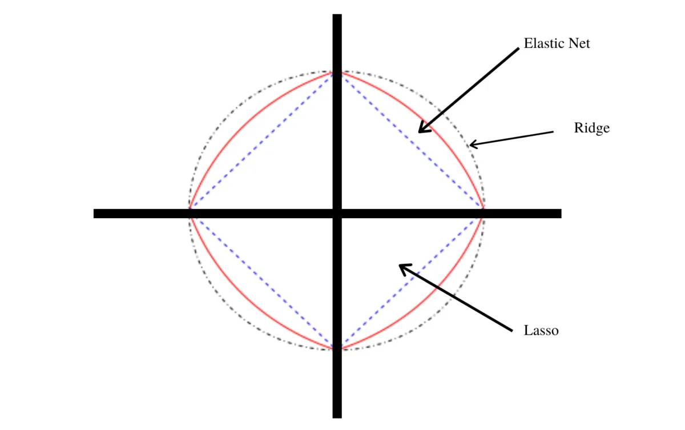
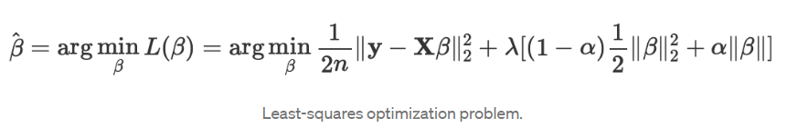
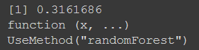
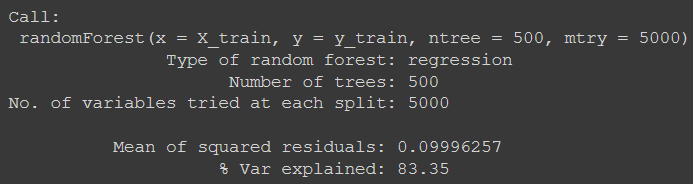

```{r setup, include=FALSE}
knitr::opts_chunk$set(echo = TRUE)
```

```{r}
library(dplyr)
library(Hmisc)
library(fitdistrplus)
library(logspline)
library(Sim.DiffProc)
library(gap)
library(DescTools)
library(gamlss)
library(gamlss.dist)
library(gamlss.add)
library(hash)
library(reshape)
library(plotly)
library(glmnet)
library(caret)
library(randomForest)
library(sail)
library(splitTools)
library(groupdata2)
```


# Zadanie 1

a)

Wczytujemy dane

```{r}

X_train <- read.csv(file = './data/X_train.csv')
y_train <- read.csv(file = './data/y_train.csv')
X_test <- read.csv(file = './data/X_test.csv')

```

```{r}

dim(X_train)
dim(X_test)
dim(y_train)

```

Dane treningowe zawierają 3794 obserwacji, z kolei dane testowe 670. Zmiennych jest 9000.

Przyjrzyjmy się typom danych. 

```{r}

length(select_if(X_train,is.numeric))
length(select_if(X_test,is.numeric))
str(y_train)

```

Z opisu danych jasno wynika, że powinniśmy się spodziewać danych w pełni numerycznych. Faktycznie tak jest, każda z kolumn jest typu numerycznego.

Sprawdźmy czy dane są kompletne.

```{r}

sum(is.na(X_train))
sum(is.na(X_test))
sum(is.na(y_train))

```

Dane są kompletne.

b)

Policzmy najpierw kilka podstawowych statystyk i pokażmy histogram


```{r}

summary(y_train)
y_train.vector <- unlist(as.vector(y_train))
hist(y_train.vector,breaks = 45)

```


Na ten moment ciężko stwierdzić, jaki to rozkład.

Użyjemy teraz funkcji descdist, żeby znaleźć kandydatów na poszukiwany rozkład.


```{r}

descdist(y_train.vector, discrete = FALSE, boot=500)

```

Z wykresu wynika, że kandydatami na rozkład jest rozkład jestostajny lub rozkład beta.

Sprawdźmy jak wygląda rozkład epmiryczny w porównaniu do rozkładu jednostajnego.

```{r}

fit.unif <- fitdist(y_train.vector, "unif")
fit.unif
plot(fit.unif)

```

Naszą uwagę w szczególności powinien przykuć QQ-plot. Widzimy, że moglibyśmy z dużym przymróżeniem oka przyjąć, że wykres nawija się na linię prostą, jednak początek wykresu może nas w szczególności martwić. Również histogram nie fituje zbyt dobrze.

Sprawdźmy zatem rozkład beta.

Niestety nasz rozkład nie jest w [0,1], w przeciwieństwie do rozkładu beta. Zatem wstrzymujemy nasze rozważania nad tym kandydatem.


Weźmy jeszcze dla porównania rozkład normalny.

```{r}

fit.norm <- fitdist(y_train.vector, "norm")
plot(fit.norm)

```

Tutaj QQ-plot wygląda koszmarnie, sytuacja na początku wykresu jest jeszcze gorsza niż w przypadku uniform. Histogram też nie fituje zbyt dobrze.

Zatem na podstawie tych wykresów póki co optowalibyśmy za rozkładem jednostajnym

Sprawdźmy teraz Kryterium informacyjne Akaikego (AIC)

```{r}

fit.norm$aic
fit.unif$aic

```

Dla potwierdzenia, że rozkład jednostajny pasuje tutaj lepiej, widzimy, że aic jest dla niego mniejsze, niż dla rozkładu normalnego.

Przeprowadźmy teraz test Kolmogorova-Smirnova

```{r}

set.seed(5)

sample.unif.distribution <- runif(3794, min=0, max=2.864712	) # tworzymy wektor z rozkładu jednostajnego o wyestymowanych wcześniej min i max

ks.test(y_train.vector, sample.unif.distribution)

```

p-value jest bardzo małe, więc odrzucamy hipotezę zerową, że rozkłady są równe.

Sprawdźmy jeszcze jak wygląda wykres ECDF vs CDFs np. dla rozkładu normalnego, jednostajnego, czy dla rozkładu exp.


```{r}

fit.norm <- fitdist(y_train.vector, "norm")
fit.exp <- fitdist(y_train.vector, "exp")
fit.unif <- fitdist(y_train.vector, "unif")


cdfcomp(list(fit.norm, fit.exp, fit.unif),
 legendtext = c("norm", "exp", "unif"))

```

Widzimy, że żaden z rozkładów nie fituje jakoś specjalnie dobrze.


Spróbujmy innej metody.
fitDist z biblioteki fitdistrplus stara się dopasować nasz rozkład do wielu znanych rozkładów, wybierając najlepszy według mle.

```{r}

fit <- fitDist(y_train.vector, k = 2, type = "realplus", trace = FALSE, try.gamlss = TRUE)

summary(fit)

```

Najlepszym otrzymanym rozkładem okazał się exp(0.115873), ponownie spróbujmy testu Kolmogorova-Smirnova

```{r}

sample.exp.distribution <- rexp(3794, rate = 0.115873) # tworzymy wektor z rozkładu wykładniczego z wyestymwoanym parametrem

ks.test(y_train.vector, sample.exp.distribution)

```

Tutaj również p-value bardzo małe, więc odrzucamy hipotezę zerową, że rozkłady są równe.

Na podstawie powyższych rozważań nie udało nam się dopasować rozkładu empirycznego do żadnego znanego nam rozkładu.

c)

Wybierzemy najpierw 250 najbardziej skorelowanych zmiennych ze zmienną objaśnianą. Napiszmy funkcję...

```{r}

get_most_correlated <- function(x,y,n) {
  # funkcja zwracająca nazwy n najbardziej skorelowanych zmiennych ze zmienną objaśnianą
  # input: x - DataFrame odpowiadający zmiennym objaśniającym, y - dataframe odpowiadający zmiennej objaśnianej,
  #        n - zmienna typu integer ile skorelowanych zmiennych chcemy zwrócić
  # output: lista nazw zmiennych
  
  h <- list() # w tej liście przechowamy informację o korelacjach
  
  for (i in 1:ncol(x))
  {
      h[[colnames(x[i])]] <- abs(cor.test(unlist(as.vector(x[i])), unlist(as.vector(y)), method="pearson")$estimate)
      # dla każdej zmiennej wprowadzamy wartość jej korelacji ze zmienną objaśnianą do listy typu key-value
  }
    
  h <- h[order(unlist(h), decreasing=TRUE)] # sortujemy listę malejąco według wartości
  
  return(names(h[1:n])) # zwracamy n pierwszych wartości

}

most_correlated <- get_most_correlated(X_train,y_train,250) # zgarniamy 250 najardziej skorelowanych wartości

```

Policzmy korelacje między parami oraz wyświetlmy heatmapę. Myślę, że najlepszą heatmapę w naszym przypadku uzyskamy korzystając z biblioteki plotly.

```{r}

corr <- cor(X_train[,c(most_correlated)]) # zgarniamy korelacje między sobą pomiędzy uzyskanymi zmiennymi
corr <- round(corr, 2) # wyniki zaokrąglamy

plot_ly(z = corr, x = most_correlated, y = most_correlated, type = "heatmap")   

```


# Zadanie 2

a)
Elastic Net pojawił się po raz pierwszy w wyniku krytyki lassa, którego dobór zmiennych może być zbyt zależny od danych, a przez to niestabilny.
Regresja Elastic Net łączy w sobie cechy Ridge oraz Lasso, poprzez zastosowanie dwóch typów norm, których istotność względem siebie kontroluje hiperparametr α. Elastic Net najlepiej nadaje się do modelowania danych z dużą liczbą wysoce skorelowanych predyktorów.
Warto zaznaczyć, że pomimo ogromnej ilości zmiennych nie zajmiemy się future selection, bo to LASSO, czy elastic net dokonują feature selection, nakładając na odpowiednie cechy współczynnik = 0.



Zadaniem elastic net jest zminimalizowanie następującej funkcji:


Uzyskując przy tym estymator wektora parametrów β.

Hiperparametry:
- λ ( parametr regularyzacji ), to stała mnożąca warunki kary. λ = 0 jest odpowiednikiem zwykłej metody najmniejszych kwadratów, rozwiązywanej przez regresję liniową. Z kolei λ = 1 jest używana do otrzymania pełnej kary. Gdy λ zwiększa się w nieskończoność, to efekt regularyzacji jest wzmocniony i jedynym celem staje się utrzymanie małych współczynników β, zamiast minimalizowania funkcji straty. Powszechne są bardzo małe wartości lambady, takie jak 1e-3 lub mniejsze.
- α ( parametr mieszania ), należy do przedziału [0,1]. Dla α = 0 otrzymujemy regresję grzbietową, a dla α = 1 otrzymujemy LASSO.

b)

Tworzymy grid używając funkcji z biblioteki caret.

Uwaga: naszym kryterium błędu będzie pierwiastek ze sredniego błędu kwadratowego.

```{r}

grid <- expand.grid(alpha = c(0, 0.2, 0.4, 0.6, 0.8, 1),
 lambda = c(0.001, 0.01, 0.1, 1, 10))

grid

```

Teraz zajmiemy się wyborem liczby podzbiorów walidacji krzyżowej.
Standardowym wyborem ilości podzbiorów jest k = 10 lub k = 5.
Jednak k=10 wybiera się z reguły wtedy gdy ilość danych jest duża, a nie jest to nasz przypadek. Zatem raczej optowalibyśmy za k = 5, czy też k = 4. 
W ogólności wybór nie jest ściśle określony, bo trudno oszacować jak dobrze nasz podzbiór tzw. fold, reprezentuje cały zbiór danych. k = 5 oznaczałoby, że każdy podzbiór składałby się z około 3790 * 20% = 758 obserwacji. Taka ilość danych wydaje się sensowna dlatego zdecydujemy się na k = 5.

Gdyby nasz dataset treningowy obejmowal np. 100000 obserwacji, wtedy dla k=10 pojedynczy fold odnosiłby się do 10000 obserwacji, co w ogólności wystarcza na wykonanie rzetelnego testu.
Dodatkowo nie skupiamy się tu na aspekcie obliczeń numerycznych, bo mamy dostatecznie dobre komputery żeby różnica dla naszych danych pomiędzy k = 5 i k = 10 nie miała większego znaczenia jeśli chodzi o czas obliczeń.


Najpierw przeskalujmy dane.

```{r}

set.seed(1)

elnet.models <- list() # tu dodamy kolejne modele elastic net

X_train_scaled = scale(X_train)
X_test_scaled = scale(X_test, center=attr(X_train_scaled, "scaled:center"), 
                              scale=attr(X_train_scaled, "scaled:scale"))

X_train_scaled <- data.frame(X_train_scaled)
X_test_scaled <- data.frame(X_test_scaled)


folds <- split(X_train_scaled, sample(1:5, nrow(X_train_scaled), replace=T)) # dzielimy dataset na 5 podzbiorów

ind <- list() # indeksy kolejnych podzbiorów

for (j in 1:5){
  
  ind <- append(ind,list(rownames(data.frame(folds[j])))) # zgarniamy indeksy kolejnych podzbiorów
  
}

for (j in 1:5){
  print('.')
  elnet <- train(x=X_train_scaled[unlist(ind[j]),], y= y_train[as.numeric(unlist(ind[j])),], method = "glmnet",  tuneGrid=as.data.frame(grid))
  print('..')
  elnet.models <- list(elnet.models, elnet)
}

#elnet.models

```

Liczymy foldsy do walidacji krzyżowej.

```{r}

flds <- createFolds(y=unlist(y_train), k = 5, list = TRUE, returnTrain = FALSE)

train.control <- trainControl( 
    index=flds
    , verboseIter = T 
    , returnData = T 
    , savePredictions = T 
    ) 

```

```{r}
set.seed(1)

X_train_scaled = scale(X_train)
X_test_scaled = scale(X_test, center=attr(X_train_scaled, "scaled:center"), 
                              scale=attr(X_train_scaled, "scaled:scale"))

X_train_scaled <- data.frame(X_train_scaled)
X_test_scaled <- data.frame(X_test_scaled)

#cv_5 <- trainControl(method = "cv", number = 5)

y_train <- as.numeric(unlist(y_train))
elnet <- train(x=X_train_scaled, y=y_train, method = "glmnet",trControl = train.control, tuneGrid=as.data.frame(grid))

```


```{r}

elnet

```

Zatem na podstawie naszej 1 próby cross-validacyjnej ( w praktyce warto zrobić więcej, ale ze względu na czytelność 4b) ograniczmy się do 1 ) powinniśmy wybrać α = 0.2 i  λ = 0.1.

Rzućmy teraz okiem na błędy na poszczególnych zbiorach walidacji krzyżowej.

```{r}

elnet$resample

```

Stąd błąd walidacyjny modelu to

```{r}

mean(elnet$resample[,'RMSE'])

```

A błąd treningowy to

```{r}

y_train.pred <- predict(elnet, X_train_scaled) # dokonujemy predykcji na zbiorze treningowym
train.error <- sqrt(mean(( unlist(as.vector(y_train)) - y_train.pred)^2))

train.error

```

To wygląda sensownie. Zazwyczaj błąd treningowy jest mniejszy niż błąd zbioru walidacyjnego.

# Zadanie 3

```{r}

grid <- expand.grid(
  mtry = c(200,250,300,350,400),
  ntree = c(2, 3, 4),
  nodesize= c(5, 10, 15, 20))

```

Narazie nie będziemy wgłębiać się w preprocessing, ze względu na to, że random forest jest metodą "off-the-shelf", czyli tak naprawdę sam w sobie jest gotowy w użyciu.

```{r}

set.seed(1)

X_train.ext <- X_train
X_train.ext$y <- y_train

# Bierzemy te same indeksy co przy elasticnet

mse.list <- list() # tu będziemy wrzucać wyniki dla zbiory walidacyjnego dla danego zestawu hiperparametrów


for (i in 1:nrow(grid)){
  
  mse.oneforest <- list() # lista mse dla zbiorów z cv dla bieżącego drzewa
  
  for (j in 1:5){
    

    
    my.randomForest <- randomForest(x=X_train.ext[unlist(flds[j]),c(1:9000)], y= X_train.ext[unlist(flds[j]),c(9001)],
                                    mtry=grid$mtry[i], ntree=grid$ntree[i], nodesize=grid$nodesize[i])
  mse.oneforest <- append(mse.oneforest, tail(my.randomForest$mse, n=1)) # https://stat.ethz.ch/pipermail/r-help/2004-April/049943.html ,                                                          ostatni zwracany mse to mse całego lasu
  }
  mse.list <- append(mse.list, mean(unlist((mse.oneforest)))) # dodajemy średnią z listy dla bieżącego drzewa

}


```

```{r}

mse.min.ind <- which.min(mse.list)
grid[mse.min.ind,]

```

Ponieważ w pętli nie przechwytujemy najlepszego modelu to wytrenujmy random forest ponownie dla optymalnych hiperparametrów ( opisywany przykład jest na tyle niewielki, że możemy sobie pozwolić na takie podejście).

```{r}

final.forest.rmse.cv <- list()

for (j in 1:5){
    
    final.randomForest <- randomForest(x=X_train.ext[unlist(flds[j]),c(1:9000)], y= X_train.ext[unlist(flds[j]),c(9001)],
                                    mtry=grid$mtry[mse.min.ind], ntree=grid$ntree[mse.min.ind], nodesize=grid$nodesize[mse.min.ind])
  final.forest.rmse.cv <- append(final.forest.rmse.cv, sqrt(tail(final.randomForest$mse, n=1))) # https://stat.ethz.ch/pipermail/r-help/2004-April/049943.html ,                                                          ostatni zwracany mse to mse całego lasu, sqrt bo chcemy rmse
  
}

final.forest.rmse.cv

```

b)
```{r}
unlist(final.forest.rmse.cv)
```
Tworzymy podsumowanie tabelaryczne

```{r}

ElasticNet <- unlist(elnet$resample['RMSE'])
   
RandomForest <- unlist(final.forest.rmse.cv)
    
summary.df<- data.frame(ElasticNet, RandomForest)
rownames(summary.df) <- c("Fold1", "Fold2", "Fold3", "Fold4", "Fold5")
summary.df
```

Widzimy, że ElasticNet dla naszych foldów radzi sobie lepiej.

Możemy jeszcze sprawdzić mse na zbiorze treningowym. Dla elasticnet błąd treningowy przechowaliśmy w zmiennej train.error. Teraz policzymy dla RandomForest

```{r}

elnet.train.error <- train.error

final.randomForest <- randomForest(x=X_train.ext[,c(1:9000)], y= X_train.ext[,c(9001)],
                                    mtry=grid$mtry[mse.min.ind], ntree=grid$ntree[mse.min.ind], nodesize=grid$nodesize[mse.min.ind])

random_forest.train.error <- sqrt(tail(final.randomForest$mse, n=1))

elnet.train.error
random_forest.train.error

```

Ponownie ElasticNet radzi sobie na zbiorze lepiej. Zauważmy też, że w poprzednich rozważaniach wybraliśmy model o największych hiperparametrach spośród siatki.
Niestety nie mamy dostępu do zbioru testowego. Ale na podstawie tego jak modela radzą sobie na zbiorze walidacyjnym, stwierdzamy, że ElasticNet jest lepszym wyborem, bo błąd jest mniejszy.

Porównajmy jeszcze nasze modele z modelem referencyjnym

```{r}

reference.rmse.cv <- list()

for (j in 1:5){
    
  avg.y_train <- mean(X_train.ext[unlist(flds[j]),c(9001)])
    
    reference.rmse.cv <- append(reference.rmse.cv, sqrt(mean((X_train.ext[unlist(flds[j]),c(9001)] - avg.y_train)^2)))
  
}

Reference <- unlist(reference.rmse.cv)

summary.df$ReferenceModel <- Reference

summary.df

```

Jak widzimy model referencyjny wypada słabo i tego mogliśmy się spodziewać. Ale warto było kontrolnie sprawdzić jego wyniki. Gdyby jego wyniki były lepsze od któregoś z modeli, to prawie na pewno popełnilibyśmy po drodze jakiś błąd.

# Zadanie 4

W tym zadaniu podejścia mogą być różne. W szczególności warto zastanowić się nad tym jakie modele znamy i czy możemy je wykorzystać. W poprzednich podpunktach rzuciliśmy okiem na elasticnet i randomforest. Patrząc na wyniki możemy stwierdzić, że randomforest nie poradził sobie najlepiej, jak na złożoność jego modelu. Wyświetlmy informacje o wytrenowanym modelu:

```{r}
print(final.randomForest)
```

Naszą uwagę powinien przykuć dość niski procent wyjaśnionych danych.
Wiemy, że czas naszej pracy jest skończony, dlatego musimy obrać taktykę. Zdecyduje się na trenowanie randomforest na lepszym gridzie, bo spodziewam się po tym modelu, że może poradzić sobie znacznie lepiej. Jeśli otrzymam zadawalające wyniki to zakończę rozważania, jeśli nie, to zmienię strategię.

Powtarzamy nasze rozważania dla random forest, ale dla siatki o większych parametrach.

```{r}

grid <- expand.grid(
  mtry = c(1000,5000),
  ntree = c(500,750))

```

```{r}
set.seed(1)

mse.list <- list() # tu będziemy wrzucać wyniki dla zbiory walidacyjnego dla danego zestawu hiperparametrów


for (i in 1:nrow(grid)){
  
  mse.oneforest <- list() # lista mse dla zbiorów z cv dla bieżącego drzewa
  
  for (j in 1:5){
    

    
    my.randomForest <- randomForest(x=X_train.ext[unlist(flds[j]),c(1:9000)], y= X_train.ext[unlist(flds[j]),c(9001)],
                                    mtry=grid$mtry[i], ntree=grid$ntree[i], nodesize=grid$nodesize[i])
  mse.oneforest <- append(mse.oneforest, tail(my.randomForest$mse, n=1)) # https://stat.ethz.ch/pipermail/r-help/2004-April/049943.html ,                                                          ostatni zwracany mse to mse całego lasu
  }
  mse.list <- append(mse.list, mean(unlist((mse.oneforest)))) # dodajemy średnią z listy dla bieżącego drzewa

}
```

```{r}
mse.min.ind <- which.min(mse.list)
grid[mse.min.ind,]
```

Zatem wytrenujmy model dla uzyskanych hiperparametrów, na całych danych.

( Kod gdyby google colab nie chcial współpracować )

```{r}

# set.seed(1)
# 
# final.randomForest <- randomForest(x=X_train, y=y_train, mtry=5000, ntree=500)
# final.forest.rmse.cv <- sqrt(tail(final.randomForest$mse, n=1)) # https://stat.ethz.ch/pipermail/r-help/2004-April/049943.html , ostatni zwracany mse to mse całego lasu, sqrt bo chcemy rmse
# 
# print(final.forest.rmse.cv)
# print(final.randomForest)

```




Z powodu słabych podzespołów mojego komputera, skorzystałem z google colab:

https://colab.research.google.com/drive/1RART58R4S0Nn-FYAMZDNJXmK7TnJXrEy?usp=sharing

Model trenował się +-4h, uzyskane wyniki są zadawalające ( 83% wyjaśnionych danych i całkiem dobry bląd dla danych testowych). Potencjalnie moglibyśmy się jeszcz pokusić o spróbowanie grida o większych wartościach mtry.


( Kod do predykcji gdyby google colab nie chcial współpracować )

```{r}

# final.predictions <- predict(final.randomForest, newdata = X_test)
# Id <- c(0:669)
# final.df <- data.frame(Id,final.predictions)
# 
# colnames(final.df) <- c('Id','Expected')
#                   
# write.csv(final.df, file="predictions.csv", row.names = FALSE)

```


Bibliografia:
- Wykłady i laboratoria przedmiotu Statystyczna Analiza Danych wydziału MIMUW: https://usosweb.mimuw.edu.pl/kontroler.php?_action=katalog2/przedmioty/pokazPrzedmiot&kod=1000-714SAD

- https://stats.stackexchange.com/questions/132652/how-to-determine-which-distribution-fits-my-data-best
- https://stackoverflow.com/questions/44507568/error-when-fitting-a-beta-distribution-the-function-mle-failed-to-estimate-the
- https://stats.stackexchange.com/questions/126539/testing-whether-data-follows-t-distribution/126552#126552
- https://www.rdocumentation.org/packages/Sim.DiffProc/versions/2.5/topics/test_ks_dbeta
- https://stackoverflow.com/questions/2661402/given-a-set-of-random-numbers-drawn-from-a-continuous-univariate-distribution-f
- https://towardsdatascience.com/selecting-the-best-predictors-for-linear-regression-in-r-f385bf3d93e9
- https://gdudek.el.pcz.pl/files/SUS/SUS_wyklad6.pdf
- https://scikit-learn.org/stable/modules/generated/sklearn.linear_model.ElasticNet.html
- https://machinelearningmastery.com/elastic-net-regression-in-python/
- https://www.datacamp.com/tutorial/tutorial-ridge-lasso-elastic-net
- https://towardsdatascience.com/optimization-of-elastic-net-regularization-for-predicting-soil-clay-content-7df09f6a68f8
- https://corporatefinanceinstitute.com/resources/knowledge/other/elastic-net/
- https://daviddalpiaz.github.io/r4sl/elastic-net.html
- https://datascience.stackexchange.com/questions/28158/how-to-calculate-the-fold-number-k-fold-in-cross-validation
- https://www.baeldung.com/cs/train-test-datasets-ratio
- https://www.analyticsvidhya.com/blog/2022/02/k-fold-cross-validation-technique-and-its-essentials/
- https://scikit-learn.org/stable/modules/cross_validation.html
- https://www.projectpro.io/recipes/create-and-optimize-baseline-elasticnet-regression-model
- https://www.youtube.com/watch?v=1dKRdX9bfIo&ab_channel=StatQuestwithJoshStarmer
- https://stats.stackexchange.com/questions/187335/validation-error-less-than-training-error
- https://rpubs.com/phamdinhkhanh/389752
- https://stats.stackexchange.com/questions/172842/best-practices-with-data-wrangling-before-running-random-forest-predictions